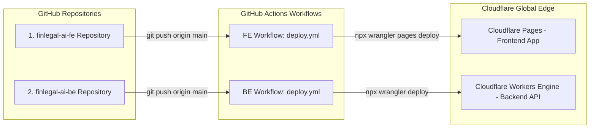

# 🛠️ Lexifin - Hướng Dẫn Hạ Tầng Cloudflare & Quy Trình CI/CD (Cloudflare Edge & CI/CD Mastery Guide v3.3)

> **Dành cho Người Học/Ứng Viên:** Tài liệu này giải thích chi tiết cách vận hành hạ tầng Cloudflare Serverless Edge (Workers, R2, D1, Vectorize, Workers AI, Google Gemini API) và quy trình tự động hóa GitHub Actions CI/CD theo chuẩn hóa phỏng vấn kỹ thuật.

---

## 💡 1. Hạ Tầng Cloudflare Serverless Native Stack

Hệ thống Lexifin v3.3 tận dụng 100% hệ sinh thái Cloudflare Edge & Google Gemini Multimodal API:
- **Cloudflare Workers (Hono.js Engine)**: API backend chạy trên 300+ edge locations toàn cầu, thời gian phản hồi siêu tốc (<50ms).
- **Cloudflare R2 Object Storage**: Nơi lưu trữ file văn bản gốc (`PDF`, `DOCX`, `XLSX`, `TXT`) không tốn phí egress data.
- **Cloudflare D1 Database**: CSDL SQLite Serverless quản lý bản ghi tài liệu, trạng thái vòng đời (`UPLOADED`, `PARSING`, `CHUNKING`, `EMBEDDING`, `INDEXING`, `READY`, `FAILED`), cây phân cấp điều khoản và lịch sử chat audit.
- **Cloudflare Vectorize Index**: Kho lưu trữ Vector Embeddings **768 chiều** phục vụ truy xuất RAG siêu tốc.
- **Cloudflare Workers AI & Gemini API**:
  - **Embedding**: `@cf/baai/bge-base-en-v1.5` (768 chiều đồng bộ 100% với Vectorize Index).
  - **Multimodal & Main LLM Primary**: **Google Gemini 2.5 Flash** (`gemini-2.5-flash`, `gemini-2.5-flash-lite`, `gemini-1.5-flash`) với cửa sổ ngữ cảnh 1.000.000 tokens.
  - **Edge Models Failover**: `@cf/qwen/qwen3-30b-a3b-fp8` (Model 30B mạnh nhất) và `@cf/mistral/mistral-7b-instruct-v0.1`.

---

## 🏗️ 2. Mô Hình 2 Repositories Độc Lập (2-Repo Architecture)

Hệ thống được chia tách thành **2 Repositories độc lập**:



---

## ⚙️ 3. Các Bước Cấu Hình Từ Đầu Đến Cuối (Step-by-Step Setup)

### Bước 1: Khởi Tạo Secrets Trên GitHub Repositories & Cloudflare Worker
Trên cả 2 Repositories (`finlegal-ai-fe` & `finlegal-ai-be`), truy cập:  
`Settings` $\rightarrow$ `Secrets and variables` $\rightarrow$ `Actions` $\rightarrow$ Thêm 2 Secrets:

| Tên Secret | Mô Tả & Ý Nghĩa |
| :--- | :--- |
| `CLOUDFLARE_API_TOKEN` | Mã chìa khóa cấp quyền cho GitHub deploy ứng dụng lên Cloudflare. |
| `CLOUDFLARE_ACCOUNT_ID` | Mã định danh tài khoản Cloudflare của bạn (`78eede6ec04d52fe8b367f14cecb7c08`). |

Thêm **Encrypted Secret `GEMINI_API_KEY`** trực tiếp vào Cloudflare Production bằng CLI:
```bash
npx wrangler secret put GEMINI_API_KEY
```

---

### Bước 2: Workflow CI/CD Chi Tiết

#### A. Workflow Frontend (`finlegal-ai-fe/.github/workflows/deploy.yml`)
```yaml
name: Deploy Lexifin Frontend Pages

on:
  push:
    branches:
      - main

jobs:
  deploy:
    name: Build & Deploy Next.js to Cloudflare Pages
    runs-on: ubuntu-latest

    steps:
      - name: Checkout Code
        uses: actions/checkout@v4

      - name: Setup Node.js 22
        uses: actions/setup-node@v4
        with:
          node-version: 22
          cache: 'npm'

      - name: Install Dependencies
        run: npm install

      - name: Run TypeScript Check (CI)
        run: npm run typecheck

      - name: Build Next.js Production Bundle
        run: npm run build
        env:
          NEXT_PUBLIC_BACKEND_URL: https://finlegal-backend.lvthanh-work.workers.dev
          NEXT_PUBLIC_TURNSTILE_SITE_KEY: 0x4AAAAAAENuyoUuTRh2b7uR

      - name: Deploy to Cloudflare Pages (CD)
        run: npx wrangler pages deploy out --project-name=finlegal-ai
        env:
          CLOUDFLARE_API_TOKEN: ${{ secrets.CLOUDFLARE_API_TOKEN }}
          CLOUDFLARE_ACCOUNT_ID: ${{ secrets.CLOUDFLARE_ACCOUNT_ID }}
```

#### B. Workflow Backend (`finlegal-ai-be/.github/workflows/deploy.yml`)
```yaml
name: Deploy Lexifin Backend Worker

on:
  push:
    branches:
      - main

jobs:
  deploy:
    name: Typecheck & Deploy Worker to Cloudflare
    runs-on: ubuntu-latest

    steps:
      - name: Checkout Code
        uses: actions/checkout@v4

      - name: Setup Node.js 22
        uses: actions/setup-node@v4
        with:
          node-version: 22
          cache: 'npm'

      - name: Install Dependencies
        run: npm install

      - name: Run TypeScript Check (CI)
        run: npm run typecheck

      - name: Deploy Worker to Cloudflare Production (CD)
        run: npx wrangler deploy --minify
        env:
          CLOUDFLARE_API_TOKEN: ${{ secrets.CLOUDFLARE_API_TOKEN }}
          CLOUDFLARE_ACCOUNT_ID: ${{ secrets.CLOUDFLARE_ACCOUNT_ID }}
```

---

## 🎯 4. Bộ Câu Hỏi & Trả Lời Phỏng Vấn CI/CD & Production Diagnostics

### ❓ Q1: "Bạn xem nhật ký hệ thống (Live Logs) trên Cloudflare Workers Production bằng cách nào?"
> **💡 Gợi ý trả lời:**  
> *"Em sử dụng 2 công cụ chính để xem log trực tiếp theo thời gian thực:*  
> *- **Xem trên Cloudflare Dashboard:** Truy cập `Workers & Pages` $\rightarrow$ chọn Worker `finlegal-backend` $\rightarrow$ Tab `Logs` $\rightarrow$ Bấm **Begin streaming logs**.*  
> *- **Xem trên CLI Terminal:** Chạy câu lệnh `npx wrangler tail` từ máy cá nhân. Mọi log xử lý AI (`[LLM Vision]`, `[LLM API Executing]`, `[LLM Success]`) sẽ hiển thị tức thì khi người dùng tương tác."*

---

### ❓ Q2: "Làm thế nào để bảo mật API Keys và Secrets trên hạ tầng Cloudflare Serverless?"
> **💡 Gợi ý trả lời:**  
> *"Em áp dụng nguyên tắc **Zero Hardcoding**: Toàn bộ Secret nhạy cảm như `GEMINI_API_KEY`, `TURNSTILE_SECRET_KEY` hay `LANGFUSE_SECRET_KEY` được mã hóa 100% qua lệnh `npx wrangler secret put GEMINI_API_KEY` trên Cloudflare Worker Environment Variables hoặc lưu trong GitHub Repository Secrets. Mã nguồn không bao giờ chứa thông tin bí mật dạng plain text hay đẩy lên Git."*
